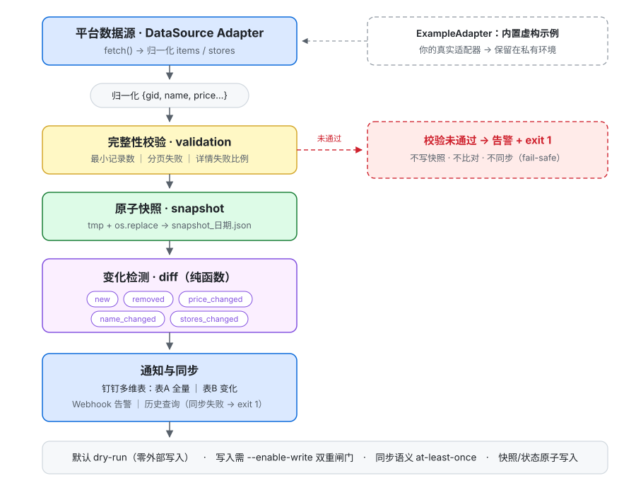

# biz-change-monitor


业务对象历史变化监控引擎 —— 以稳定业务 ID 为关联键，持续采集 → 快照 → 历史比对 → 变化事件 → 通知/多维表 → 历史查询。

> 适用场景：任何"ID 稳定、属性会变"的业务对象——商品价格、套餐内容、适用门店、库存状态、SaaS 数据、API 返回值……
> 本仓库附带一个**虚构数据**的示例适配器，克隆即可跑通全链路，无需任何账号。

## 为什么写它

每个业务 ID 每天都在悄悄变：名字改了、价格调了、门店加减了。
靠人肉对账，一百个 ID 就已经是灾难——而没有人应该在流水账里度过清晨。

这个工具把这件事交给机器：**每天自动采集 → 存下快照 → 和昨天比对 → 只把变化告诉你**。
你只需要在变化真正重要的时候，抬起头。

> **一句话**：把"今天和昨天比，什么变了？"这件每天重复的事，变成机器的日常。

欢迎提建议、报 Issue、一起把它打磨得更好。

## 核心流程



纯函数 Diff 检测 5 类变化：`new`（新增）/ `removed`（下架）/ `price_changed`（价格）/ `name_changed`（名称）/ `stores_changed`（适用门店）。

## 特性

- **纯函数 Diff**：不依赖浏览器/网络/平台 SDK，可独立测试
- **防误报设计**：分页失败拦截、字段缺失不误判、价格数值化容错（"99.0"≡99）、门店比较顺序无关
- **原子快照 + 容错读取**：中断不留半文件，损坏文件自动跳过
- **写入幂等**：同日重跑默认跳过已成功写入的表，降低重复写入风险（at-least-once，详见下文钉钉同步章节）
- **数据源可插拔**：实现一个 `DataSource.fetch()` 即接入新平台
- **钉钉集成可选，默认关闭**：`python main.py` 永远是 dry-run（绝不写多维表、绝不获取 accessToken；仅严重故障会发 Webhook 告警消息）；写入需显式 `--enable-write` 且通过双重校验（严格响应校验，未知结构默认失败）+ 失败 Webhook 告警

## 快速开始

```bash
git clone https://github.com/<your-username>/biz-change-monitor.git
cd biz-change-monitor
python3 -m venv venv && source venv/bin/activate
pip install -r requirements.txt

# 跑测试
python tests/test_diff.py

# 跑一次示例流程（虚构数据，dry-run 模式）
python main.py
```

## 接入你的数据源

1. 在 `adapters/` 下新建 `my_adapter.py`，继承 `DataSource` 并实现 `fetch()`：

```python
from .base import CollectionResult, DataSource
from core.models import make_item

class MyAdapter(DataSource):
    name = "my_platform"

    def fetch(self) -> CollectionResult:
        items = [make_item("ID-001", name="项目A", price=99.0, count=1)]
        stores = {"ID-001": ["门店1", "门店2"]}
        return CollectionResult(items=items, stores=stores, total=len(items),
                                failed_pages=[])
```

2. 在 `main.py` 里把 `ExampleAdapter` 换成你的适配器。

**去资产化原则**：平台接口地址、参数结构、登录态处理等若涉及公司内部系统或商业平台，请保持在私有环境，不要提交到公共仓库。

## 钉钉同步（可选，默认关闭）

1. 钉钉开放平台创建企业内部应用，获取 AppKey/AppSecret；创建多维表（表A 全量 / 表B 变化）
2. `cp config/config.example.yaml config/config.yaml` 并填入配置，`chmod 600` 保护
3. **默认运行是 dry-run**：只采集、快照、比对、打印变化，**绝不写多维表、绝不获取 accessToken**——即使配置里已填真实凭据（仅严重故障会发 Webhook 告警消息）
4. 确认无误后，用 `python main.py --enable-write` 显式启用写入：
   - 需同时通过两项校验：数据源非示例适配器（虚构数据禁止写入真实表）+ 钉钉配置齐备，否则拒绝并退出
   - 写入响应做**严格校验**：无错误字段且含已知数据键（records/id/ids/success）才算成功；未知结构默认按失败处理
   - 首次真实写入若提示"未知响应结构"，按打印的响应键人工核对官方文档后更新 `notifications/dingtalk.py` 的 `_WRITE_SUCCESS_KEYS`
   - 50 行/批；sync_state 以"表 ID + 日期"记录当天已成功同步状态，同日重跑默认跳过（数据摘要 SHA-256 截断值仅存档用于审计核对，不参与跳过判断）；失败 Webhook 告警、失败退出码非零
   - 同步语义为 **at-least-once**：极端情况下（写入成功但标记前崩溃）同一批次可能重复一次

## 定时运行

`deploy/launchd/` 提供 macOS launchd 模板；Linux 用 cron / systemd timer 执行同一条命令即可。

## 测试

```bash
python tests/test_diff.py           # Diff 引擎：12 项
python tests/test_dingtalk_sync.py  # 钉钉同步安全：37 项（全 Mock）
python tests/test_main_safety.py    # 主流程安全：25 项（临时目录隔离）
pytest tests/                       # 或 pytest 一键全部（74 项）
```

覆盖：新增/删除/价格/名称/门店变化、多字段同变、零误报、数值容错、字段缺失、默认运行零外呼、写入模式安全闸门、严格响应校验、状态损坏 fail-safe、重复 gid 拒绝、基线缺失跳过门店比对。

## 安全与合规声明

- 本项目是个人技术学习与工程实践作品：核心价值在于展示「以稳定业务 ID 关联、采集→快照→比对→通知」的通用工程实现，不构成任何商业产品或服务，也不针对任何特定平台提供运营支持
- 本项目定位为**用户对自己有权访问的数据**做自动化历史管理
- 使用者需自行确认目标平台的服务条款，遵守适用法律法规
- 本项目**不提供**绕过登录、权限或安全机制的功能；不内置任何平台专属适配器
- 不保证任何平台内部接口的长期兼容性
- Meituan / DingTalk（钉钉）等均为各自权利人的商标，本项目与其无关联

## License

Apache-2.0（见 [LICENSE](LICENSE)）

## Roadmap

- [ ] v0.2：查询机器人框架移植（钉钉 Stream，管理员白名单 + 审计日志）
- [ ] v0.2：更多通知渠道（飞书 / Telegram / 邮件）
- [ ] v0.3：SQLite 存储后端可选；Web 查看面板
